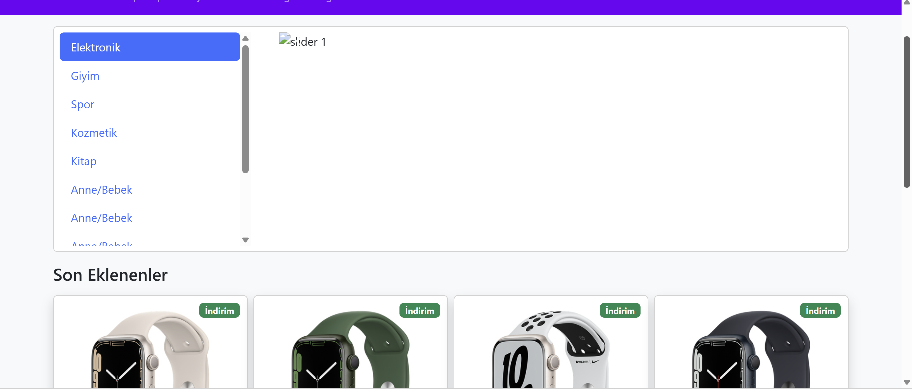

# 🛒 E-Commerce Website

Farklı kategorilerde ürünlerin listelendiği, kullanıcıların ürün detaylarını inceleyip alışveriş sepetine ekleyebileceği **modern**, **responsive** bir e-ticaret web sitesidir.

<p align="left">
  <a href="https://img.shields.io/badge/status-active-success">  </a>
  <a href="https://img.shields.io/badge/license-MIT-informational">  </a>
  <a href="https://img.shields.io/badge/tech-HTML5%20%7C%20CSS3%20%7C%20JavaScript-blue">  </a>
</p>

---

## 📷 Önizleme

<p align="center">
  
</p>

---

## ✨ Özellikler

- Kategori bazlı ürün listeleme
- Ürün detay sayfaları
- Ürünleri sepete ekleme ve sepetten çıkarma
- Responsive (mobil uyumlu) tasarım
- Bootstrap ve Font Awesome ile modern arayüz

---

## 🛠️ Teknolojiler

- **HTML5**
- **CSS3**
- **JavaScript (Vanilla JS)**
- **Bootstrap 5**
- **Font Awesome**

---

## ⚙️ Kurulum ve Çalıştırma

```bash
# Depoyu klonla
git clone https://github.com/HilalOnler/e-commerce-website.git

# Klasöre gir
cd e-commerce-website

# Tarayıcıda aç (sadece index.html'i açman yeterli)
# Windows
start index.html
# macOS
open index.html
# Linux
xdg-open index.html
```

---

## 🧭 Sayfa Yapısı

- **Home (index.html)** — Slider ve ürün listeleme
- **Details (details.html)** — Ürün detayları
- **Shopping Cart (shopping-cart.html)** — Sepet görünümü
- (Opsiyonel) **Login / Hesabım / Wishlist** sayfaları

---

## 🌐 English (Short)

**E-Commerce Website** is a modern, responsive web app to **browse, view and shop products**  
with category filtering, product details and shopping cart functionality — built with **HTML, CSS, JS, Bootstrap**.

---

## 🤝 Katkı (Contributing)

Öneriler ve katkılar memnuniyetle karşılanır! Lütfen bir **issue** açın veya **pull request** gönderin.

---

## 📄 Lisans

Bu proje **MIT** lisansı ile lisanslanmıştır. Ayrıntılar için `LICENSE` dosyasına bakın.
